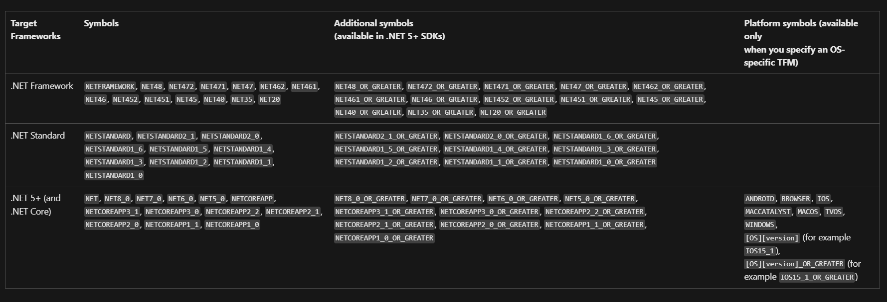

# Learning How Basic Coding Constructs Are Expressed in C# - Day 5

> I was unable to cover comments and whitespaces yesterday and I don't plan to document what I learn about it today, since it is kinda simple to understand. Today's focus will be on preprocessor directives in C#.

### Preprocessor Directives in C#

Preprocessor directives give instructions to the compiler to preprocess the information before actual compilation starts.

> Though C# doesn't have a preprocessor, the directives are still processed as if there were one.

#### Notes on Preprocessor Directives

- Preprocessor directives are not statements and are not terminated by a semicolon.
- Preprocessor directives can appear anywhere in the code.
- Preprocessor directives start with a hash symbol (#).

#### Preprocessor Directives

- `#nullable` - This directive is used to enable or disable nullable reference types.
- Conditional directives - These directives are used to compile the code based on the condition. The conditional directives are `#if`, `#else`, `#elif`, and `#endif`.
- `#define` - This directive is used to define a symbol.
- `#undef` - This directive is used to undefine a symbol.
- `#error` and `warning` - These directives are used to generate an error or warning message.
- `#line` - This directive is used to modify the compiler's line number and file output for debugging. This is useful when the code is generated by another program.

#### Example

```csharp
#define DEBUG
#define VC_V10

using System;
public class Test
{
	public static void Main()
	{
#if (DEBUG && !VC_V10)
			Console.WriteLine("DEBUG is defined");
		#elif (!DEBUG && VC_V10)
			Console.WriteLine("VC_V10 is defined");
		#elif (DEBUG && VC_V10)
			Console.WriteLine("DEBUG and VC_V10 are defined");
		#else
			Console.WriteLine("DEBUG and VC_V10 are not defined");
		#endif
	}
}
```

Another use of the `#line` directive is to hide some lines of code from the debugger. This is done by setting `#line hidden` before the code to be hidden and `#line default` after the code.

```csharp
#line hidden
Console.WriteLine("This line is hidden");
#line default
Console.WriteLine("This line is not hidden");
```



- `#pragma` - This directive is used to enable or disable certain features. The `#pragma` directive is used to suppress warnings and to enable or disable certain features. It provides two features:
	- `#pragma warning` - This directive is used to suppress or enable certain warnings.
	- `#pragma checksum` - This directive is used to provide a checksum for the file which overrides the default checksum generated by the compiler.

```csharp
// disable the warning
#pragma warning disable CS0168

// enable the warning
#pragma warning restore CS0168
```

```csharp
// provide a checksum for the file
#pragma checksum "filename" "{guid}" "checksum bytes"
```

> The `#pragma` directive is a directive you will want to use sparingly. It is not a good practice to suppress warnings. It is better to fix the warnings. It is often useful in generated code. Also, this directive can be used to control warnings from code analyzers, not just the compiler. Analysers are tools that can be used to enforce coding standards and best practices e.g. StyleCop, FxCop, etc.

- `#region` and `#endregion` - These directives are used to define a block of code. The `#region` directive marks the beginning of the block and the `#endregion` directive marks the end of the block.

```csharp
#region MyRegion
// code
#endregion
```

> `#region` basically do nothing, but ensures that the compiler checks for a matching `#endregion` directive. These directives exist entirely for the benefit of text editors and IDEs e.g. Visual Studio allows you to collapse and expand sections of code using these directives.
